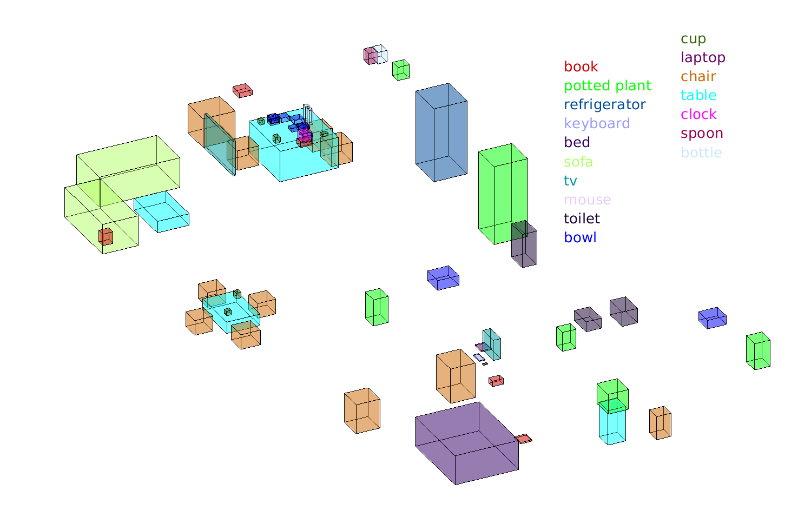
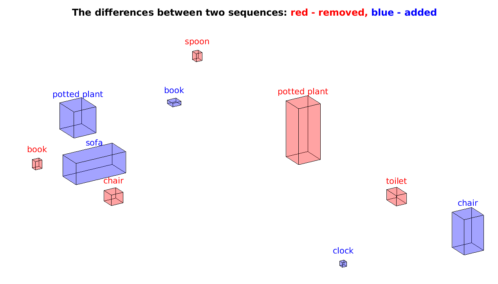

# BenchBot Add-on: Object Map Quality (OMQ) evaluation method

This add-on contains an implementation of the Object Map Quality (OMQ) method for numerically evaluating the quality of an object map with respect to another ground truth object map.

The implementation is in Python, and is used through either the [`benchbot_eval`](https://github.com/qcr/benchbot) script or [BenchBot Evaluation Python package](https://github.com/qcr/benchbot_eval).

## Using the add-on

Results are submitted for OMQ evaluation in either the `object_map` or `object_map_with_states` format, for Semantic SLAM and Scene Change Detection (SCD) tasks respectively.
Ground-truth for an environment is to be provided in the `object_map_ground_truth` format.

For full details on these formats please see the [`formats_object_map` documentation](https://github.com/benchbot-addons/formats_object_map).

Evaluation is performed using the `evaluate` function and results are combined using the `combine` function.

**Important notes on submitted results:**

- Support is given for class name synonyms if a matching synonym has been defined in the submitted ground truth and is present in the results `class_list`.
- Any class names given in the results `class_list` that are not present in the ground truth `class_list` & don't have an appropriate synonym, will have their probability added to the `'background'` class (this avoids over-weighting label predictions solely because your detector had classes that were not supported)
- all probability distributions in the results (`label_probs` and `state_probs`) are normalized if their total probability is greater than 1 or have the missing probability added to `'background'` or `'unchanged'` classes if it is less than 1.

## OMQ Algorithm

Object map quality compares the object cuboids of a ground-truth object-based semantic map with the object cuboids provided by a generated object-based semantic map. The metric compares both geometric overlap of the generated map with the ground-truth map, and the accuracy of the semantically labelling in the generated map.

The steps for calculating OMQ for a generated object-based semantic map are as follows:

1. Compare each object in the generated map to all ground-truth objects, by calculating a _pairwise object quality_ score for each pair. The pairwise object quality is the geometric mean of all object sub-qualities. Standard OMQ has two object sub-quality scores:

   - _spatial quality_ is the 3D IoU of the ground-truth and generated cuboids being compared
   - _label quality_ is the probability assigned to the class label of the ground-truth object being compared to

   Note that the pairwise object quality will be zero if either sub-quality score is zero - like when there is no overlap between object cuboids.

2. Each object in the generated map is assigned the ground-truth object with the highest non-zero pairwise quality, establishing the _"true positives"_ (some non-zero quality), _false negatives_ (ground-truth objects with no pairwise quality match), and _false positives_ (objects in the generated map with no pairwise quality match).

3. A _false positive cost_, defined as the maximum confidence given to a non-background class, is given for all false positive objects in the generated map

4. Overall OMQ score is calculated as the sum of all "true positive" qualities divided by the sum of: number of "true positives", number of false negatives, & total false positive cost

Notes:

- Average pairwise qualities for the set of "true positive" objects are often also provided with the overall OMQ score. Average pairwise qualities include an average overall quality, as well as averages for each of the object sub-qualities (spatial & label for standard OMQ)
- False positive cost is given as a summary statistic as false positive quality (1 - cost) where a high quality score means the false positives were largely ignored as they were low confidence
- OMQ is based on the probabilistic object detection quality measure PDQ, which is described in [our paper](http://openaccess.thecvf.com/content_WACV_2020/papers/Hall_Probabilistic_Object_Detection_Definition_and_Evaluation_WACV_2020_paper.pdf) and [accompanying code](https://github.com/david2611/pdq_evaluation)).

### Evaluating Semantic SLAM with OMQ

Evaluation compares the object-based semantic map (as shown above) generated by the robot with the ground-truth map of the environment using OMQ. The evaluation metric is used exactly as described above.

### Evaluating scene change detection (SCD) with OMQ

Scene change detection (SCD) creates object-based semantic maps comprising of the objects that have _changed_ between two scenes. Valid changes are the addition or removal of an object, with unchanged provided as a third state to capture uncertainty in state change.

Evaluation of SCD compares the object-based semantic map of changed objects generated by the robot with the ground-truth map of object changes between two scenes in an environment. The comparison is done using OMQ, but a third pairwise object sub-quality is added to capture the quality of the detected state change:

- _state quality_ is the probability given to the correct change state (e.g. [0.4, 0.5, 0.1] on an added object would get a state score of 0.4)
- _final pairwise quality_ ([step 1 of OMQ](<#object-map-quality-(omq)>)) is now the geometric mean of three sub-quality scores (spatial, label, and state)
- _false positive cost_ ([step 3 of OMQ](<#object-map-quality-(omq)>)) is now the geometric mean of both the maximum label confidence given to a non-background class, and the maximum state confidence of a added or removed state change (i.e. not unchanged). This means both overconfidence in label and state change will increase the false positive cost.
- **Note:** including state quality changes the quality scores for pairs of generated and ground-truth objects due to averaging over 3 terms instead of 2 (i.e. pairwise scores will be different between semantic SLAM and SCD tasks)
